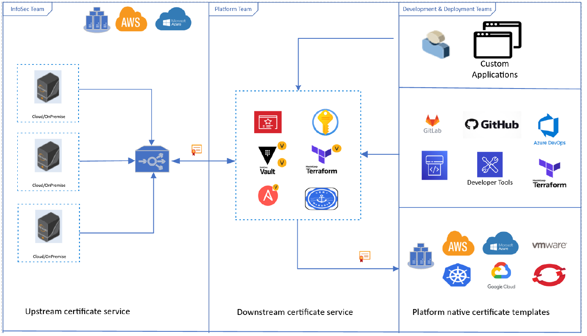

\newpage

# Proposed Strategy

I suggests that enterprises address security using a 3-tiered strategy. We explain the above-mentioned strategy by focusing on X.509 certificate (hereafter: certificate) as a machine identity. However, the strategy can be adopted for other machine identities like SSH keys and API/Access Tokens.  

Certificates are used to identify different entities such as person, organization, account, process, workloads, or device by using the associated private key. The use of certificates spread from traditional to modern IT infrastructures. Traditionally, network devices have used certificates to enable secure communication using TLS protocol, Operating system and browsers have used certificates to provide root-of-trust, code signing systems have used certificates to digitally sign and verify artifacts to establish the authenticity of the author and integrity of the artifacts. Modern runtime frameworks like SPIFFE/SPIRE and Service Meshes have also recognized the need to use certificates to establish identity for workloads running in cloud-agnostic environments like Kubernetes and Serverless. This entails that enterprises will see a significant growth of certificate consumption in coming years. Managing certificates had been a challenge for InfoSec teams in the past and this challenge will only get bigger as enterprises transition to more modern IT infrastructures. 

This is a depiction of the proposed strategy. InfoSec team establishes upstream certificate service using Venafi’s Trust Protection Platform (TPP). Platform teams establish downstream certificate services using native certificate management services like AWS ACM and Azure Key Vault, cloud-agnostic platforms like Kubernetes and HashiCorp Vault, and infrastructure and configuration management tools like Terraform and Ansible. Development & Deployment teams use certificates in custom applications, CI/CD pipelines, infrastructure and cloud platforms.

InfoSec team should act as a service provider and establish an upstream certificate service for different teams providing following features:  

    * Provide support to enforce security policies in a pro-active and automated manner.  

    * Provide altering and notification capabilities. 

    * Provide support to establish ownership of certificates.  

    * Provide logging and traceability support to establish accountability.  

    * Provide crypto agility.  

    * Provide different integration methods ranging from APIs, SDKs to Platform native plugins. 

    * Provide support for approval process to meat change control board requirements. 

    * Provide high-availability and the ability to scale based on demand from consumers.  

Like any other InfoSec program in an enterprise, broadcasting and communicating information to different business units is a key aspect of establishing a service delivery model. InfoSec team should share information about the availability of the upstream certificate service to Platform teams. In addition, developing platform specific integration guidelines are also important to help bootstrap Platform teams.      

While a Platform team should act as a consumer of the upstream certificate service, established by InfoSec team, it should also establish a downstream certificate service using different platform native integration methods. On one hand, the downstream certificate service will enable InfoSec team to pro-actively enforce security policies within the platform, it will also allow Development & Deployment teams to easily retrieve certificates compliant with company’s security policies and take the burden off from the Platform team to manage the lifecycle of certificates  

The downstream certificate service can operate in either pull integration model or push integration model. 

    * Pull integration model: Pull integration model is where the upstream certificate service is only acting as a source of policy compliant certificates. Any certificate request originating through the platform is routed to upstream certificate service and the certificate is retrieved. This orchestration process is primarily handled by the downstream certificate service. Pull integration model is suitable for teams that are managing modern cloud-agnostic platforms like OpenShift or HashiCorp Vault, or where deployment of environments and applications is handled by modern Infrastructure and configuration managements tools like Terraform and Ansible.  

    * Push integration model: Push integration model is where the upstream certificate service can push certificates to the downstream certificate service. This orchestration process is handled by the upstream certificate service. Push model is suitable for teams managing public cloud infrastructure like AWS, Azure, GCP and where cloud-provider native services are used heavily by Development & Deployment teams.    

For Platform teams, broadcasting and communicating information to Development & Deployment teams is critical to enable self-service. The availability of a downstream certificate service and development of platform specific certificate templates can help Development & Deployment teams to organically embed security in existing developer and deployment workflows. 

While a Development & Deployment team should act as a consumer of the downstream certificate service, it should disband out-of-band certificate request practices and only use platform specific certificate templates. This ensures that all certificates that have been issued are compliant with enterprise’s security policies and the burden of managing certificate lifecycle is offloaded to downstream certificate service.