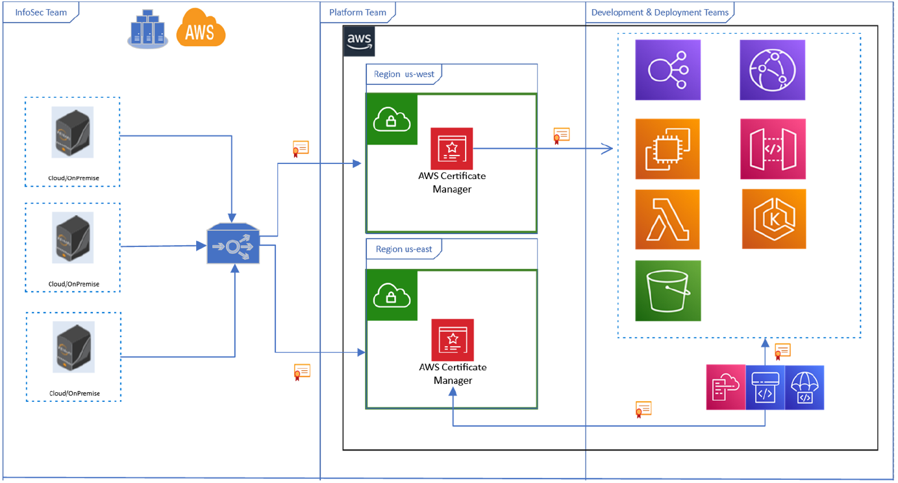

\newpage 

## Security Strategy for AWS ACM

The above diagram shows a depiction of the proposed strategy for ACM using push integration model for securely getting policy compliant certificates from upstream certificate service. InfoSec team provides upstream certificate service using Venafi’s TPP that orchestrates the lifecycle of the certificate from request, renewal, revocation to provisioning certificates. Once the certificate is provisioned to ACM, different AWS-native services can consume certificates from ACM. Code Deploy, Code pipelines or CloudFormation services can be used for applications deployed in AWS but not using AWS native services.
For a Platform team managing AWS cloud deployment introducing ACM as a downstream service is recommended where the use of AWS-native services is understood to be rising across different Development & Deployment teams. Acting as a downstream service, ACM will only handle the deployment of certificates to AWS-native services. The provisioning and management of certificates along with policy enforcement is done through upstream certificate service established by the InfoSec team. It will allow the Platform team to establish ACM as a single source of certificates in Azure and cater to different Development & Deployment teams using AWS-native services.

### References
* [ACM Discovery Policy](material/aws-min-acm-discovery-policy.json)