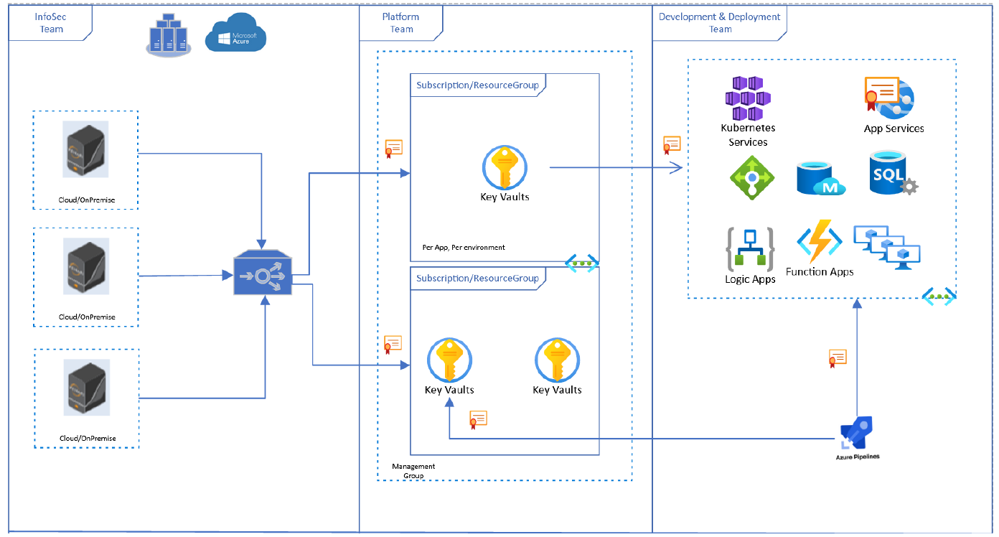

\newpage 

## Security Strategy for Microsoft Azure KeyVault

The above diagram shows a depiction of the proposed strategy for AKV using push integration model for securely getting policy compliant certificates from upstream certificate service. InfoSec team provides upstream certificate service using Venafi’s TPP that orchestrates the lifecycle of the certificate from request, renewal, revocation to provisioning certificates. Once the certificate is provisioned to AKV, different
Azure-native services can consume certificate in AKV using URIs. For applications deployed in Azure but not using Azure-native services, Azure DevOps pipelines can be used to access and consume certificates
from AKV.
For a Platform team managing Azure cloud deployment introducing AKV as a downstream service is recommended where the use of Azure-native services is understood to be rising across different Development & Deployment teams. Acting as a downstream service, AKV will only handle the deployment of certificates to Azure-native services. The provisioning and management of certificates along with policy enforcement is done through upstream certificate service established by the InfoSec team. It will allow the Platform team to establish AKV as a single source of certificates in Azure and cater to different Development & Deployment teams using Azure-native services.

### References
* [Integrate TPP with Azure Key Vault](azure/akv-downstream-service.md)
* [Integrate TPP with Azure Application Gateway](azure/akv-application-gateway.md)
* [Integrate TPP with Azure App Service](azure/akv-app-service.md)