# Introduction

Implementing Azure Key Vault as a downstream certificate service is recommended if: 

* There is an increasing need to install enterprise policy compliant certificates to native Azure services like Azure Front Door, Azure application gateways, WebApps, etc.
* **(or)** Azure Platform team has the ability to use CI/CD tools like ADO, Jenkins to provision certificates to Infrastructure as a Service or 3rd party vendor integrations available in Azure.
* **(or)** There is a enterprise policy decision to manage all secrets (including certificates) in Azure Key Vault. 

This technical document outlines (1) the procedure to integrate Venafi's TPP with Azure Key Vault using push integration model. (2) provides guidance on roles played by InfoSec, Platform and Development & Deployment teams. (3) integration with native Azure services like application gateways and front door.

\newpage

# Procedure

Following steps are required to configure integration between Venafi’s Trust Protection Platform & Azure Key Vault.

1.	Creating a client authentication certificate in TPP. 
2.	Registering an App in Azure Active Directory. 
3.	Configure the App authentication with the client certificate for OAUTH client credential flow.
4.	Configure API permissions on the App.
5.	Create an Azure KV in a Resource Group (in Hub or Spoke VNET).
6.	Assign roles & access policies to the Azure KV.

Following steps are required to provision a certificate from Venafi’s Trust Protection Platform to Azure Key Vault. 

1.	Create certificate Request
2.	Approve certificate Request
3.	Install certificate to Azure Key Vault.

Following steps should be following to configure the certificate to Azure Application Gateway.

1.	Run PowerShell script to configure certificate with Azure Application Gateway. 

\newpage

# Assigned Roles

## Platform Team as Certificate Owners

| Tasks\Teams     | InfoSec     | Platform Team     | Development & Deployment Team    |
| --------------- |:-----------:|:-----------------:|:--------------------------------:|
| Creating a client authentication certificate in TPP | R | I |  |
| Registering an App in Azure Active Directory | I | R |  |
| Configure the App authentication with the client certificate | C | R |  |
| Configure API permissions on the App |  | R |  |
| Create an Azure KV in a Resource Group (in Hub vNET) | I | R |  |
| Assign roles & access policies to the Azure KV |  | R |  |
| Create certificate Request | C/I | R |  |
| Approve certificate Request | R | I |  |
| Install certificate to Azure Key Vault | R | I |  |
| Run PowerShell script to configure certificate with Azure Application Gateway | I | R |  |

 

Identifier: 

R &rarr; Responsible for performing the task  
A &rarr; Accountable for the task  
C &rarr; Consulted for the task  
I &rarr; Informed of the task  

 

## Development & Deployment Team as Certificate Owners

| Tasks\Teams     | InfoSec     | Platform Team     | Development & Deployment Team    |
| --------------- |:-----------:|:-----------------:|:--------------------------------:|
| Creating a client authentication certificate in TPP | R | I |  |
| Registering an App in Azure Active Directory | I | R |  |
| Configure the App authentication with the client certificate | C | R |  |
| Configure API permissions on the App |  | R |  |
| Create an Azure KV in a Resource Group (in spoke vNET) | I | C | R |
| Assign roles & access policies to the Azure KV |  | R/A | C/R |
| Create certificate Request | C/I |  | R |
| Approve certificate Request | R |  | I |
| Install certificate to Azure Key Vault | R |  | I |
| Run PowerShell script to configure certificate with Azure Application Gateway | I | R/A | C/R |

 

Identifier: 

R &rarr; Responsible for performing the task  
A &rarr; Accountable for the task  
C &rarr; Consulted for the task  
I &rarr; Informed of the task  

\newpage

 

# Procedure Details

## Creating a client authentication certificate in TPP

1. Create a certificate object in TPP & Renew the certificate object. From Microsoft identity platform, there is no defined criteria on the kind of certificate needed. Essentially, it is being used as a public/private keypair. 

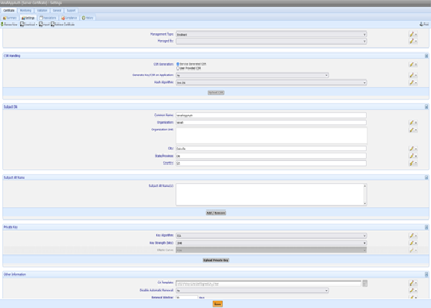

## Registering an App in Azure Active Directory

1. Login to [Azure Portal](https://portal.azure.com)
2. Browse to Azure Active Directory
3. Browse to **App registration**
4. Click on **New registration** 

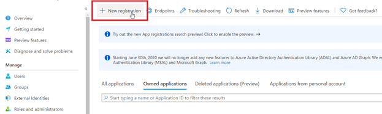

5. Give the App a sample name (forexample, **VenafiAppAuth**) & click **Register**

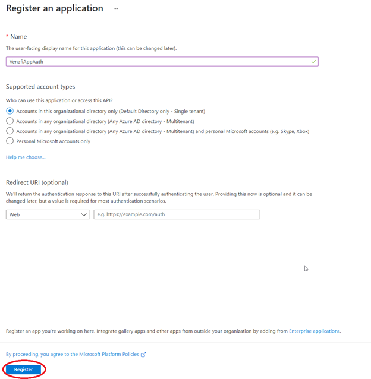

## Configure the App authentication with the client certificate

1. Download the client authentication certificate from TPP. 

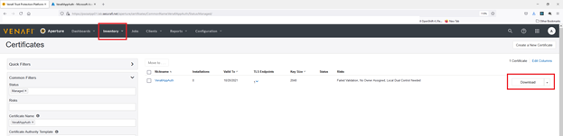

2. Select **PEM** as the download format and click **Download**

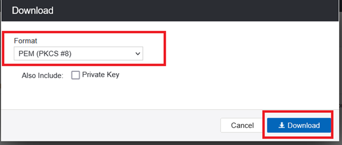

3. Login to [Azure Portal](https://portal.azure.com)
4. Browse to the registered application
5. Click on **Certificates & secrets**. This is where app is configured to use OAUTH client authorization flow for authentication.

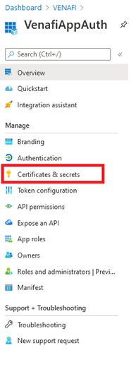

6. Under **Certificates** frame, click on **Upload certificate** & upload the client authentication certificate.

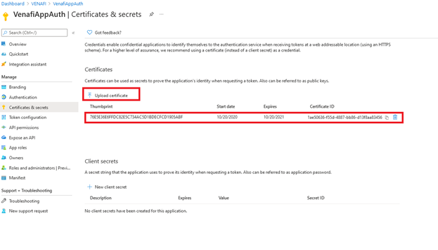

## Configure API permissions on the App

1. Login to [Azure Portal](https://portal.azure.com)
2. Browse to Azure Active Directory
3. Click on **API permissions**

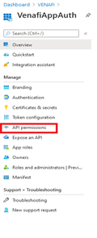

4. Add following permissions from Microsoft APIs
   1. Azure Key Vault (Type: Delegated)
   2. Azure Service Management (Type: Delegated)
   3. Microsoft Graph (Type: Delegated)

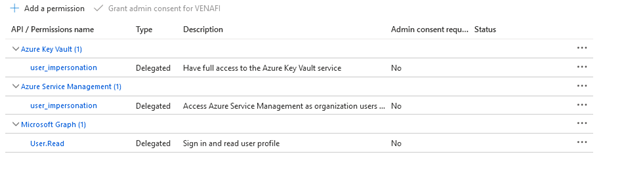

## Create an Azure KV in a Resource Group

1. Login to [Azure Portal](https://portal.azure.com)
2. Create Azure Key Vault. This document shows a manual procedure to deploy AKV, however, enterprises will generally use ARM templates or IaC tools to provision AKV along with other required services.

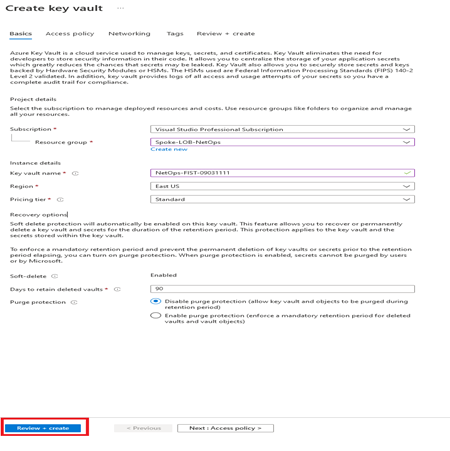

## Assign roles & access policies to the Azure KV 

An application service principle can access a KV either using RBAC or using access policies. 

### Access Policies to Azure KV

1. Browse to the created Azure KV & click **Access Control (IAM)**

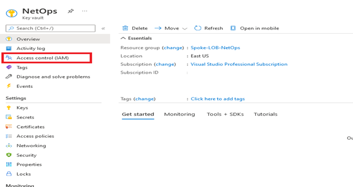

2. Assign **Key Vault Contributor" role to the App "VenafiAppAuth". In this documentation, the scope of the role is assigned at resource level, however, it may also be assigned at Resource Group level (if multiple KVs exist in 1 Resource Group).

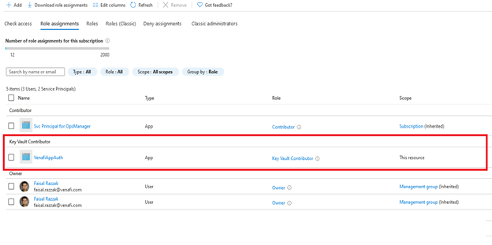

3. Browse to **Access policies**

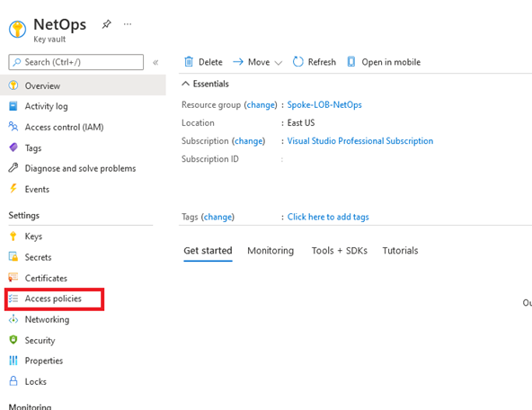

4. Assign **GET** secret permissions to "VenafiAppAuth"

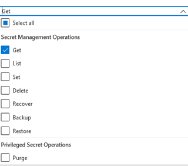

5. Assign **GET, UPDATE, LIST, CREATE, IMPORT** certificate permissions to "VenafiAppAuth.

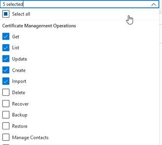

6. Click **SAVE**

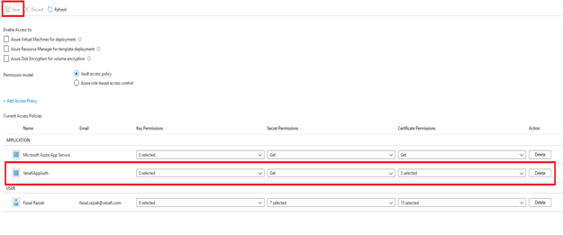

### Role based access control (RBAC)

1. Browse to the created Azure KV & click **Access policies**

2. Select **Azure role-based access control** & click **SAVE**

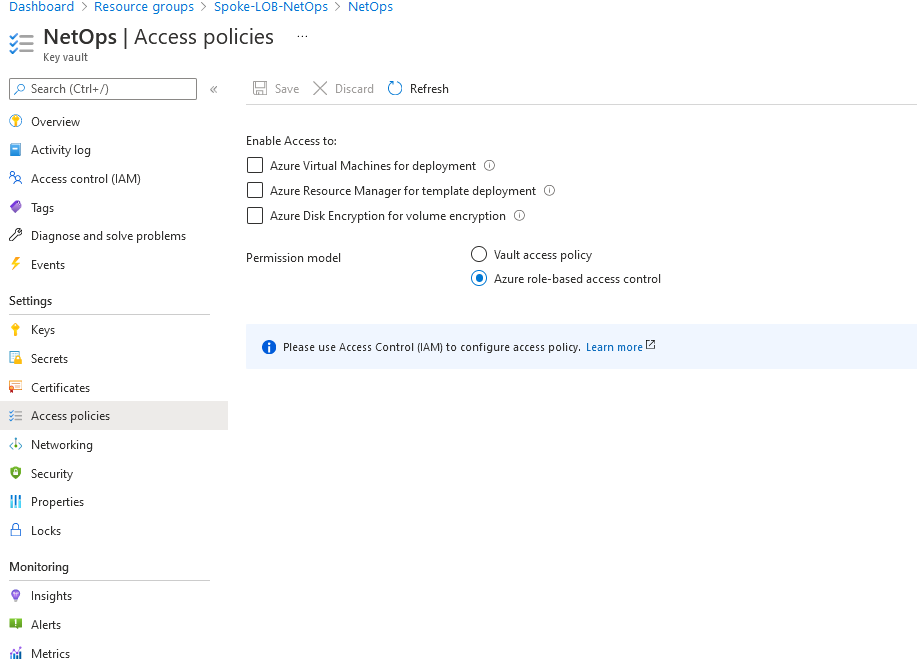

3. Now you can create Custom Roles at the subscription or resource group level. 
   1. [AKV RBAC role for provisioning](resources/policies/KV-Provisioning-Role.json)
   2. [AKV RBAC role for discovery](resources/policies/KV-Discovery-Role.json)
4. Click **Access Control (IAM)** on created Azure KV.

5. Assign custom roles to the App "VenafiAppAuth".

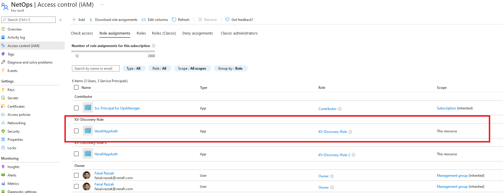

## Create Certificate Request

Before provisioning a certificate from TPP to Azure Key Vault, following information related to certificate request is needed. 

1.	Common Name and SANs
2.	Name of Azure Key Vault
3.	Application (client) ID of the Registered App in Azure Active Directory.

## Configure TPP to provision certificate to Azure Key Vault

1. Create a certificate credential in TPP using client authentication certificate. 

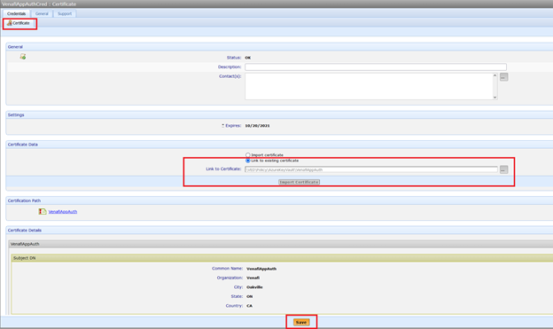

2. Create Device, Azure Key Vault application & certificate objects in TPP. 
3. At Application level, configure: 
   1. Application (client) ID.
   2. Certificate Credential created earlier.
   3. Name of Azure Key Vault
   4. Assign a name to the certificate
   5. Set "Private Key Exportable" to "Yes"

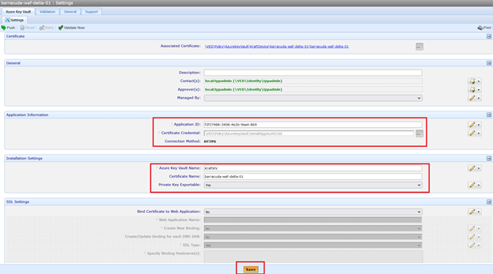

4. At the certificate object level, configure following properties & renew the object.
   1. Common Name
   2. SANs
   3. Management Type to "Provisioning".

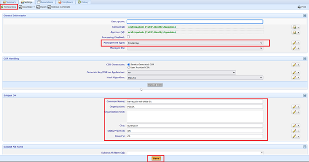

## Run PowerShell script to configure certificate with Azure Application Gateway

This PowerShell script can be triggered from any CI/CD pipeline tool. For example, Azure DevOps, Jenkins, etc.

 

<code>
$AppGW = Get-AzApplicationGateway -Name "ApplicationGateway01" -ResourceGroupName "ResourceGroup01"
$secret = Get-AzKeyVaultCertificate -VaultName "keyvault01" -Name "sslCert01"
$secretId = $secret.SecretId.Replace($secret.Version, "") # https://<keyvaultname>.vault.azure.net/secrets/
$AppGW = Add-AzApplicationGatewaySslCertificate -ApplicationGateway $AppGW -Name "Cert01" -KeyVaultSecretId $secretId
</code>

 

 

More details can be found at [link](https://docs.microsoft.com/en-us/powershell/module/az.network/add-azapplicationgatewaysslcertificate)
