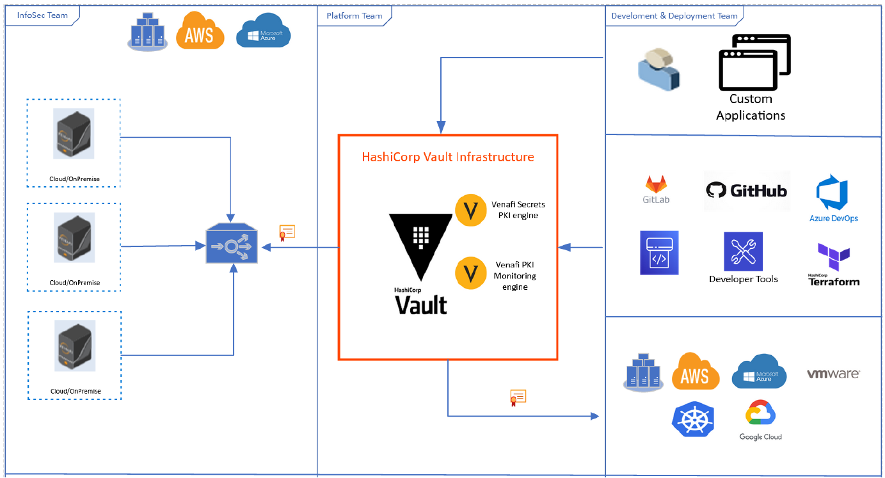

\newpage 

## Security Strategy for HashiCorp Vault

The above diagram shows a depiction of the proposed strategy for HashiCorp Vault using pull integration model for securely getting policy compliant certificates from upstream certificate service. Pull integration model is suggested as vault supports integrations with diverse infrastructure, tools and applications. InfoSec team deploys TPP as an upstream certificate service by proactively enforcing security policies, configuring notifications, reporting and assigning ownership to Platform and Development & Deployment teams. Platform teams can use 2 integrations with HashiCorp Vault to establish downstream certificate services. Venafi’s Secrets PKI engine supports requesting certificate from TPP and allow for enforcement of policies. Venafi’s PKI monitoring engine supports only policy enforcement through TPP, but the actual certificate is generated by HashiCorp Vault itself. Development & Deployment teams can use integration methods provided by vault itself to request certificates from downstream certificate service.