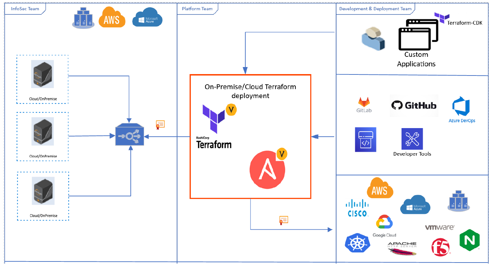

\newpage 

## Security Strategy for IaC (Terraform/Ansible)

The above diagram shows a depiction of the proposed strategy for infrastructure and configuration management platforms using pull integration model for securely getting policy compliant certificates from upstream certificate service. Pull integration model is suggested as platforms like Terraform and Ansible support a wide spectrum of platforms, network devices, and services ranging from traditional to modern IT infrastructure. The downstream certificate service is implemented by using native integrations like Venafi’s Terraform provider or Venafi ansible role. These integrations can be used to retrieve certificates from Venafi’s TPP. InfoSec team deploys TPP as an upstream certificate service by proactively enforcing security policies, configuring notifications, reporting and assigning ownership to Platform and Development & Deployment teams. Platform team configures and maintains Venafi’s Terraform provider or Venafi ansible role for all certificate requests and provide Terraform or Ansible native certificate modules or certificate roles for Development & Deployment teams, who will later them to request certificates.

### References
* [Design - Pull Integration - Terraform/Vault/TPP/AWS](iac/Terraform-Vault-TPP-AWS.png)