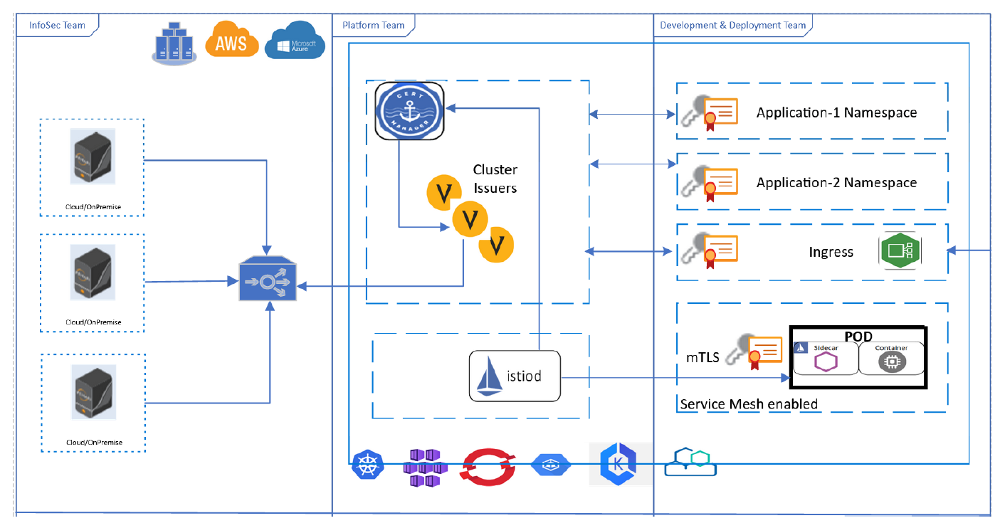

The above diagram shows a depiction of the proposed strategy for Kubernetes (k8s) using pull integration model for securely getting policy compliant certificates from upstream certificate service. The downstream certificate service is implemented using cert-manager in k8s. Cert-Manager integrates with Venafi’s TPP to provide certificates for Ingress, service mesh data plane and individual microservices. InfoSec team deploys TPP as an upstream certificate service by proactively enforcing security policies, configuring
notifications, reporting and assigning ownership to Platform and Development & Deployment teams. Platform team configures and maintains cert-manager to use the TPP for all certificate requests and
provide k8s native certificate templates for Development & Deployment teams, who will later the k8s native certificate templates (in YAML) to request certificate for microservices or ingress.